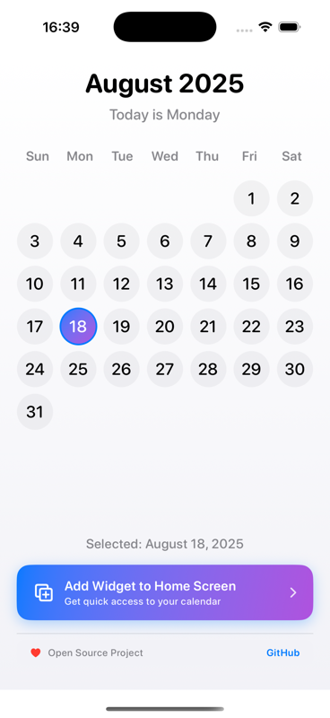
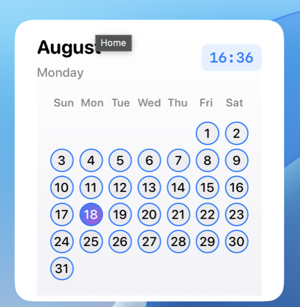

# Kalendar

A beautiful iOS calendar app with widgets built using SwiftUI and WidgetKit.

 

## Quick Start

```bash
git clone <repository-url>
cd Kalendar
open Kalendar.xcodeproj
```

**Requirements**: iOS 17.6+, Xcode 15.0+

## Development

```bash
# Run tests
./scripts/run_tests.sh

# Deploy to TestFlight
./scripts/quick-deploy.sh testflight

# Check current version
./scripts/quick-deploy.sh version
```

## Features

- Monthly calendar widget for Home Screen and Lock Screen
- Clean, minimal design with current time display
- Automatic dark/light mode support
- Reliable midnight refresh handling

## Documentation

- [Deployment Guide](DEPLOYMENT.md) - Build and release process
- [Testing Guide](TESTING.md) - Running tests and CI setup

## Contributing

Fork → Create branch → Submit PR

---

**Built with ❤️ by [@rezaiyan](https://github.com/rezaiyan)** 
