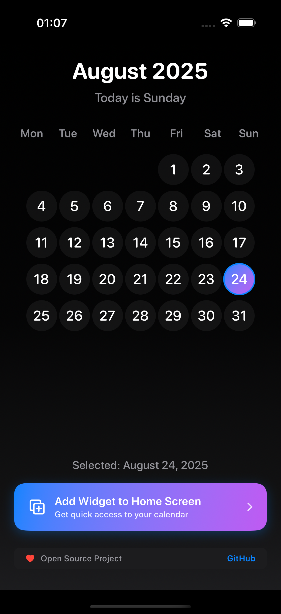
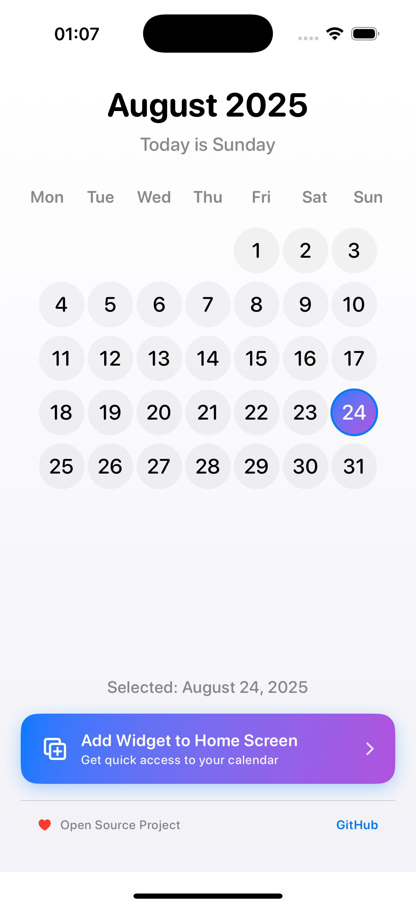
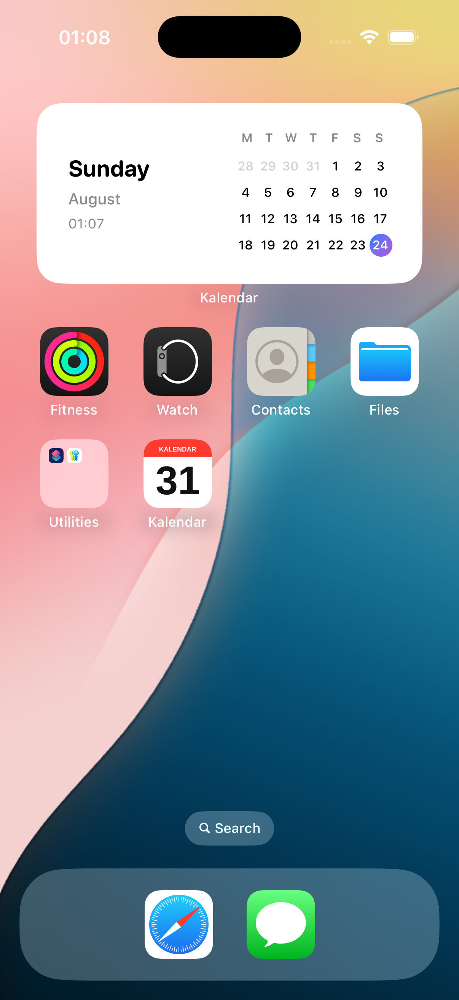
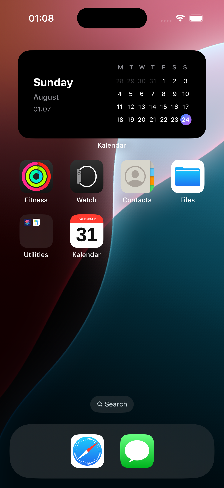

# Kalendar

A beautiful iOS calendar app with widgets built using SwiftUI and WidgetKit.

 

## 📱 Screenshots & Media

### 🎥 Video Demo
[**📺 Watch App Demo Video**](screenshots/app_demo.mp4)  
*Experience the Kalendar app in action - see the smooth transitions between light/dark modes and responsive design*

### 🌅 Light Mode
| Portrait | Landscape |
|----------|-----------|
|  |  |
| *Clean, bright interface perfect for daytime use* | *Optimized layout for horizontal viewing* |

### 🌙 Dark Mode  
| Portrait | Landscape |
|----------|-----------|
|  |  |
| *Easy on the eyes with elegant dark theme* | *Beautiful dark interface in landscape mode* |

### 🏠 Widget Integration
| Light Mode | Dark Mode |
|------------|-----------|
|  |  |
| *Seamless widget integration on home screen* | *Consistent dark theme across entire system* |

### 📅 Widget Close-up
  
*Elegant lock screen widget with current time display and monthly calendar view*

> **✨ Visual Features Showcase**: This comprehensive media collection demonstrates the app's responsive design, beautiful themes, and seamless widget integration across different orientations and system appearances.

## Quick Start

```bash
git clone <repository-url>
cd Kalendar
open Kalendar.xcodeproj
```

**Requirements**: iOS 17.6+, Xcode 15.0+

## Development

```bash
# Run tests
./scripts/run_tests.sh

# Deploy to TestFlight
./scripts/quick-deploy.sh testflight

# Check current version
./scripts/quick-deploy.sh version
```

## Features

- Monthly calendar widget for Home Screen and Lock Screen
- Clean, minimal design with current time display
- Automatic dark/light mode support
- Reliable midnight refresh handling

## 🎨 Design & Compatibility

### 📱 Universal Design
- **Multi-Orientation Support**: Seamless experience in both portrait and landscape modes
- **Adaptive Layouts**: Intelligent interface optimization for different screen orientations
- **Cross-Device Compatibility**: Supports iPhone SE to iPhone 16 Pro Max

### 🌈 Theme System
- **Light Theme**: Bright, clean interface optimized for daytime usage
- **Dark Theme**: Easy-on-the-eyes design with system-wide consistency
- **Auto-Switching**: Intelligent theme adaptation following system preferences
- **Widget Consistency**: Themes apply consistently across app and widgets

## Documentation

- [Deployment Guide](DEPLOYMENT.md) - Build and release process
- [Testing Guide](TESTING.md) - Running tests and CI setup

## Contributing

Fork → Create branch → Submit PR

---

**Built with ❤️ by [@rezaiyan](https://github.com/rezaiyan)** 
