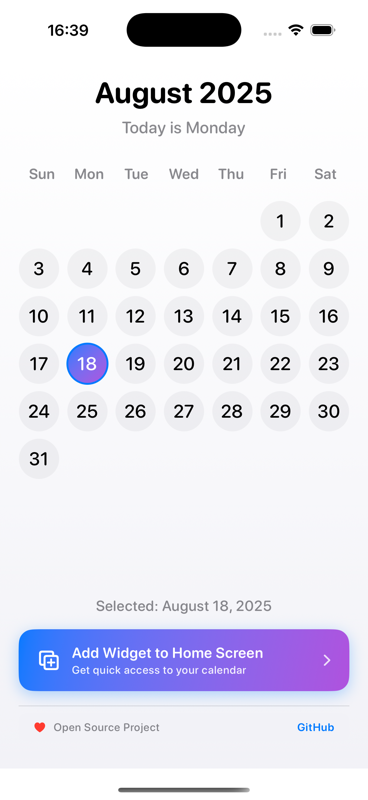
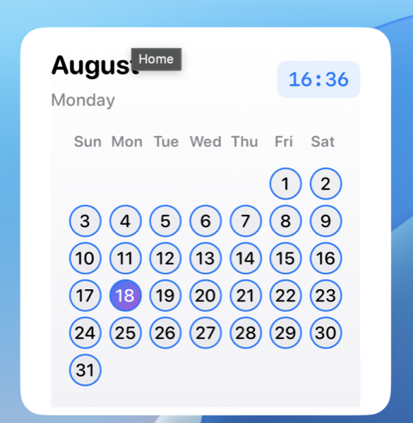

# Kalendar - iOS Calendar App with Widget

A beautiful and modern iOS calendar app featuring a creative monthly calendar widget. Built with SwiftUI and WidgetKit for a seamless user experience.

## 📱 Screenshots

### Main App Interface


### Home Screen Widget


## ✨ Features

### Main App
- **Full Month Calendar**: Interactive calendar with date selection
- **Modern UI Design**: Clean, rounded design with blue-purple gradients
- **Date Selection**: Tap any date to see it highlighted
- **Widget Setup Guide**: Built-in instructions for adding the widget
- **Open Source**: Proudly open source with GitHub integration

### Calendar Widget
- **Full Month Display**: Shows complete month calendar grid
- **Today Highlighting**: Current date highlighted with beautiful gradient
- **Time Display**: Current time shown in corner with modern styling
- **Clean Design**: Month name and day name without year clutter
- **Multiple Sizes**: Supports both medium and large widget sizes
- **Real-time Updates**: Automatically updates to show current date

## 🎯 Widget Features

### Medium Widget
- Compact month header with day name
- Current time display in top-right corner
- 7x6 calendar grid layout
- Today's date highlighted with blue-purple gradient
- Clean, modern design with subtle backgrounds

### Large Widget
- Enhanced month header with larger text
- Prominent time display with rounded background
- Larger calendar grid for better visibility
- Today's date highlighted with blue-purple gradient
- Professional appearance with proper spacing

## 🚀 Setup Instructions

### 1. Add Widget Extension Target

1. Open your project in Xcode
2. Go to **File** → **New** → **Target**
3. Select **Widget Extension** under iOS
4. Name it "KalendarWidgetExtension"
5. Make sure "Include Configuration Intent" is **unchecked**
6. Click **Finish**

### 2. Configure Widget Extension

1. In the new widget target, replace the default files with our custom ones:
   - `KalendarWidgetExtension.swift` - Main widget implementation
   - Remove default control and live activity files

2. Make sure the widget target has access to your app's shared code

### 3. Build and Run

1. Select your main app target and run it on a device or simulator
2. To test the widget:
   - Long press on the home screen
   - Tap the "+" button
   - Search for "Kalendar"
   - Add the widget to your home screen

## 🎨 Widget Customization

The widget automatically:
- Updates to show the current month
- Highlights today's date with gradient
- Shows current time in corner
- Adjusts to different widget sizes
- Uses system colors for light/dark mode support
- Removes year display for cleaner appearance

## 🔧 Technical Details

- **Built with**: SwiftUI and WidgetKit
- **iOS Support**: iOS 14+ (WidgetKit requirement)
- **Design System**: System fonts and colors for consistency
- **Architecture**: TimelineProvider for efficient updates
- **Responsive Design**: Adapts to different widget sizes
- **Performance**: Optimized SwiftUI views for compiler efficiency

## 📁 Project Structure

```
Kalendar/
├── KalendarApp.swift                    # Main app entry point
├── ContentView.swift                    # Main app interface with calendar
├── KalendarWidgetExtension/             # Widget extension target
│   ├── KalendarWidgetExtension.swift   # Widget implementation
│   ├── Assets.xcassets/                # Widget assets
│   └── Info.plist                      # Widget configuration
├── Assets.xcassets/                     # Main app assets
└── README.md                           # This file
```

## 📋 Requirements

- **iOS**: 14.0+
- **Xcode**: 12.0+
- **Swift**: 5.3+
- **Device**: iPhone or iPad with iOS 14+

## 🌟 Key Features

- **No Year Display**: Clean month-only headers
- **Simplified Day Format**: Just day name, no "Today is..." text
- **Time Integration**: Current time displayed in corner
- **Professional Appearance**: Clean, minimal design
- **Open Source**: Community-driven development

## 🤝 Contributing

This is an open source project! Contributions are welcome:

1. Fork the repository
2. Create a feature branch
3. Make your changes
4. Submit a pull request

## 📄 License

This project is open source and available under the MIT License.

## 🎉 Notes

- The widget automatically updates to show the current month
- Today's date is highlighted with a beautiful blue-purple gradient
- Supports both light and dark mode automatically
- Calendar calculations handle month boundaries and weekday alignments correctly
- Time display updates in real-time
- Clean, professional design without unnecessary text clutter

---

**Built with ❤️ by [@rezaiyan](https://github.com/rezaiyan)** 